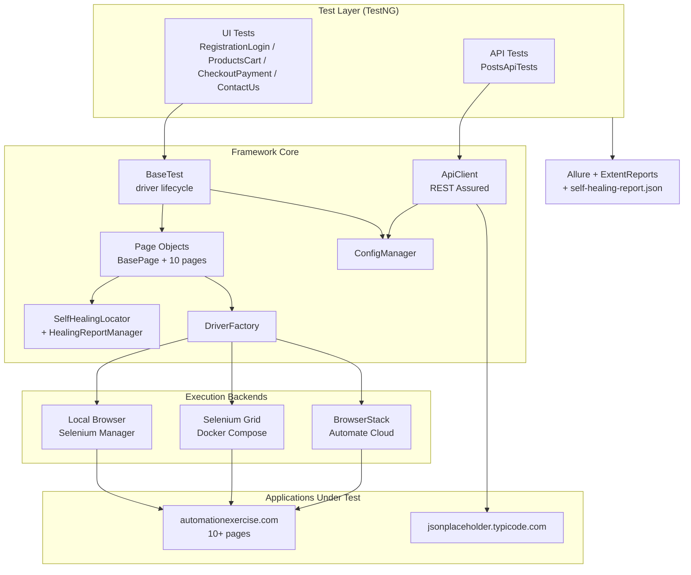

# Enterprise Hybrid Automation Framework

[](https://github.com/Bhargav2093/enterprise-hybrid-automation-framework/actions/workflows/ci.yml)
[](LICENSE)


A production-grade, hybrid (UI + API) test automation framework built in Java: **Selenium 4** with
**self-healing locators**, **REST Assured**, **TestNG** orchestration, dual **Allure** +
**ExtentReports** reporting, and three interchangeable execution backends — local, self-hosted
**Selenium Grid (Docker)**, and **BrowserStack Automate**.

It intentionally combines what would otherwise be four shallow, single-purpose repos (a Selenium
framework, a self-healing-locators demo, a REST Assured project, and a Grid/Docker setup) into one
deep, coherent framework.

See [CAPABILITIES.md](CAPABILITIES.md) for a full, detailed inventory of what it does.

## Why this exists

Most portfolio automation repos demonstrate one thing in isolation — a POM skeleton, or a REST
Assured example, or a Docker Grid config. This framework demonstrates how those pieces actually fit
together in a real project: a shared driver/config layer feeding both UI and API tests, a
locator-resilience strategy that survives real DOM churn, and a CI pipeline that proves the Grid
path actually works rather than just existing as an unverified YAML file.

## Architecture



## Key features

- **Self-healing locators** — every element is defined as an *ordered list* of candidate locators
  in [`locators.json`](src/test/resources/locators.json), not a single brittle selector. If the
  primary locator breaks but a fallback still matches, `SelfHealingLocator` uses it, logs a
  `HealingEvent`, and the suite keeps passing. All healing events are written to
  `target/self-healing-report.json` at suite end — a reviewable artifact, not just a log line.
  See [Proving self-healing works](#proving-self-healing-works) below.
- **Hybrid UI + API in one framework** — Page Objects and a REST Assured `ApiClient` share the same
  `ConfigManager`, logging, retry, and dual Allure/ExtentReports reporting stack.
- **Three execution modes**, switched with one property (`execution.mode=local|grid|browserstack`):
  local Selenium-Manager-resolved browsers, a self-hosted Dockerized Selenium Grid, or BrowserStack
  Automate cloud.
- **Parallel + cross-browser** — `testng-crossbrowser.xml` runs the smoke suite against Chrome,
  Firefox, and Edge concurrently using a thread-safe `BrowserContext` (no shared System-property
  races across parallel TestNG `<test>` tags).
- **Retry-on-failure** — `RetryTransformer` auto-applies `RetryAnalyzer` to every `@Test`, absorbing
  transient flakiness without hiding real regressions (`retry.max.count` config).
- **CI proves the Grid path** — GitHub Actions runs the smoke suite three ways: local headless
  Chrome, against a real Selenium Grid spun up as GitHub Actions `services:` (hub + chrome node,
  no Docker Compose needed in CI), and optionally against BrowserStack when repo variables/secrets
  are configured.

## Project structure

```
enterprise-hybrid-automation-framework/
├── pom.xml
├── docker/docker-compose.yml            # self-hosted Selenium Grid (hub + chrome + firefox)
├── .github/workflows/ci.yml             # smoke / grid-execution / browserstack CI jobs
├── src/main/java/com/automation/hybrid/
│   ├── config/ConfigManager.java        # -D system property > config.properties > default
│   ├── driver/                          # DriverFactory, DriverManager (ThreadLocal), BrowserContext
│   ├── selfhealing/                     # LocatorCandidate, LocatorRepository, SelfHealingLocator, HealingReportManager
│   ├── pages/                           # BasePage + 10 Page Objects for automationexercise.com
│   ├── api/                             # ApiClient, RequestSpecFactory, Jackson models
│   ├── listeners/                       # TestListener (Extent + Allure), RetryAnalyzer/Transformer, SelfHealingSuiteListener, ExtentReportSuiteListener
│   ├── reporting/                       # ExtentManager, ExtentTestManager (ThreadLocal)
│   └── utils/ScreenshotUtils.java
├── src/test/java/com/automation/hybrid/tests/
│   ├── base/BaseTest.java
│   ├── ui/                              # RegistrationLoginTests, ProductsCartTests, CheckoutPaymentTests, ContactUsTests
│   └── api/PostsApiTests.java
└── src/test/resources/
    ├── locators.json                    # centralized multi-locator repository
    ├── config.properties
    ├── testng-{smoke,regression,api,crossbrowser}.xml
    └── schemas/user-schema.json
```

## Applications under test

- **UI**: [automationexercise.com](https://automationexercise.com) — a public e-commerce site
  purpose-built for QA practice, with 10+ distinct pages exercised here: Home, Products (search),
  Product Details, Cart, Signup/Login, Account Information, Account Created, Account Deleted,
  Checkout, Payment, Order Placed, and Contact Us (including a file upload).
- **API**: [jsonplaceholder.typicode.com](https://jsonplaceholder.typicode.com) — a public fake
  REST API (`/posts`) used for CRUD + JSON-schema validation tests.

Both are third-party public sites used purely as automation targets; this framework has no
affiliation with either.

## Running locally

Requirements: JDK 17+, Maven 3.9+.

```bash
# Clone
git clone https://github.com/Bhargav2093/enterprise-hybrid-automation-framework.git
cd enterprise-hybrid-automation-framework

# Compile everything
mvn clean compile

# Smoke suite (fast subset) — local headless Chrome + API tests
mvn test -DsuiteXmlFile=src/test/resources/testng-smoke.xml -Dheadless=true

# Full regression suite
mvn test -DsuiteXmlFile=src/test/resources/testng-regression.xml -Dheadless=true

# API-only suite
mvn test -DsuiteXmlFile=src/test/resources/testng-api.xml

# Cross-browser suite (Chrome + Firefox + Edge in parallel)
mvn test -DsuiteXmlFile=src/test/resources/testng-crossbrowser.xml
```

Key `-D` overrides (see [`config.properties`](src/test/resources/config.properties) for defaults):

| Property | Values | Purpose |
|---|---|---|
| `browser` | `chrome` \| `firefox` \| `edge` | local/grid browser choice |
| `headless` | `true` \| `false` | headless local runs |
| `execution.mode` | `local` \| `grid` \| `browserstack` | execution backend |
| `grid.url` | URL | Selenium Grid hub endpoint |

### Selenium Grid (Docker)

```bash
docker compose -f docker/docker-compose.yml up -d
mvn test -DsuiteXmlFile=src/test/resources/testng-smoke.xml -Dexecution.mode=grid
docker compose -f docker/docker-compose.yml down
```

> This path is config-only in this repo's initial commit — it was written and reviewed for
> correctness but not executed locally, since Docker wasn't available in the build environment.
> Verify with `docker compose config` and a real run before relying on it. It **is** exercised in
> CI (see below), which spins up hub + chrome node directly as GitHub Actions services.

### BrowserStack Automate

```bash
export BROWSERSTACK_USERNAME=your-username
export BROWSERSTACK_ACCESS_KEY=your-access-key
mvn test -DsuiteXmlFile=src/test/resources/testng-smoke.xml -Dexecution.mode=browserstack
```

Credentials are **only** ever read from `BROWSERSTACK_USERNAME`/`BROWSERSTACK_ACCESS_KEY`
environment variables — never hardcoded, never committed, never logged.

## Reporting

Two complementary HTML reports come out of every run, driven by the same `TestListener`:

- **ExtentReports**: a single self-contained HTML file at `target/extent-report/ExtentReport.html`
  — open it directly in a browser, no CLI or server needed. Shows pass/fail/skip per test, the
  failure exception, an embedded (base64) screenshot on UI failures, and system info (browser,
  execution mode, environment, target URLs).
- **Allure**: results are written to `target/allure-results`. Generate/view the HTML report with:
  ```bash
  allure serve target/allure-results
  ```
  (requires the [Allure commandline](https://allurereport.org/docs/install/) on your PATH; not
  bundled in this repo). Test descriptions come from each `@Test` method's Allure `@Description`
  annotation, which `TestListener` also reuses as the ExtentReports test description — one source
  of truth for both reports.
- **Self-healing report**: `target/self-healing-report.json`, written at suite end.
- **Screenshots on failure**: `target/screenshots/`, also attached inline to both reports.
- **Logs**: `target/automation.log` (Log4j2).

## Proving self-healing works

`locators.json` defines multiple candidate strategies per element. To see healing in action:

1. Open `locators.json` and break a primary locator on purpose, e.g. change
   `loginSignupPage.loginButton`'s first candidate's `value` to something that no longer matches
   the page (leave the fallback candidates intact).
2. Run `mvn test -DsuiteXmlFile=src/test/resources/testng-smoke.xml -Dheadless=true`.
3. The suite still passes — `SelfHealingLocator` fell through to a fallback candidate.
4. Inspect `target/self-healing-report.json`: it contains a `HealingEvent` recording which element
   healed, which fallback strategy was used, and when.

## CI

See [`.github/workflows/ci.yml`](.github/workflows/ci.yml):

- **`smoke`** — local headless Chrome + API smoke suite on every push/PR.
- **`grid-execution`** — the same smoke suite run against a real Selenium Grid (hub + chrome node
  started as GitHub Actions `services:`), proving the Grid execution path end-to-end in CI.
- **`browserstack`** — optional; runs only when the repo variable `RUN_BROWSERSTACK_CI=true` and
  `BROWSERSTACK_USERNAME`/`BROWSERSTACK_ACCESS_KEY` secrets are configured, so the workflow never
  fails on forks/repos without BrowserStack access.

## Tech stack

Java 17 · Maven · Selenium 4 (Selenium Manager) · TestNG · REST Assured · Allure · ExtentReports · Log4j2 ·
Jackson · Docker (Selenium Grid) · BrowserStack Automate · GitHub Actions
